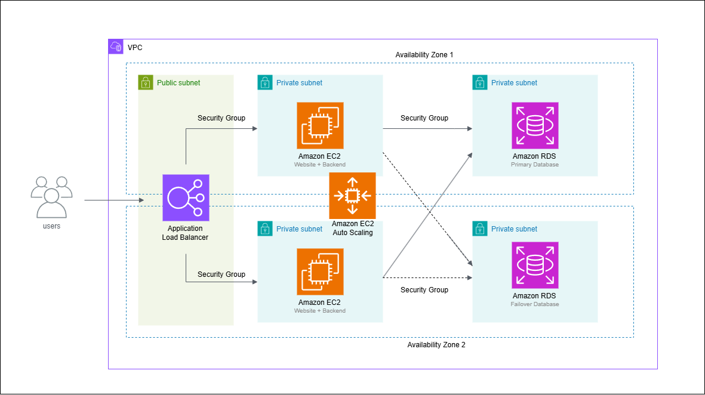

# 🏗️ Three-Tier Architecture on AWS

A three-tier web architecture deployed on AWS using **Terraform** — featuring a Flask application tier that connects to an RDS MySQL database, served through an Application Load Balancer with Auto Scaling across two Availability Zones.

---

## 📐 Architecture



```
Internet
    │
    ▼
Application Load Balancer     ← Public Subnets (AZ1 + AZ2)
    │
    ▼
EC2 Instances (Flask App)     ← Private Subnets (AZ1 + AZ2)
    │   Auto Scaling Group
    │   Target Tracking (CPU 50%)
    ▼
RDS MySQL 8.0                 ← Private DB Subnets (AZ1 + AZ2)
```

---

## ☁️ AWS Services Used

| Service | Purpose |
|---|---|
| Amazon VPC | Isolated network with public and private subnets |
| Amazon EC2 | Application tier running Flask web server |
| Auto Scaling Group | Automatically scale EC2 instances based on CPU demand |
| Application Load Balancer | Distribute traffic across EC2 instances |
| Amazon RDS (MySQL 8.0) | Database tier in private subnet |
| NAT Gateway | Allow private EC2 instances to reach the internet |
| Security Groups | Layer-by-layer network access control |

---

## 🔐 Security Design

- **ALB Security Group** — accepts HTTP (port 80) from the internet only
- **EC2 Security Group** — accepts traffic from ALB SG only (port 80)
- **RDS Security Group** — accepts MySQL connections from EC2 SG only (port 3306)
- RDS is **not publicly accessible** — isolated in private DB subnets
- EC2 instances are in **private subnets** — not directly reachable from the internet

---

## 🛠️ IaC with Terraform

This project is fully deployed using Terraform, demonstrating Infrastructure as Code principles.

```bash
# Deploy entire infrastructure
terraform init
terraform plan
terraform apply

# Tear down everything
terraform destroy
```

The entire architecture — VPC, subnets, security groups, RDS, EC2, ALB, Auto Scaling — is provisioned with a single command.

---

## 🚀 How It Works

1. User sends HTTP request to the ALB DNS name
2. ALB forwards traffic to a healthy EC2 instance
3. Flask app on EC2 connects to RDS MySQL and queries the database version
4. Response is returned to the user showing live DB connection status

**Live proof of DB connection:**


---

## 🧱 Challenges & What I Learned

**Challenge 1: RDS Subnet Group already existed**
Running `terraform apply` failed because a DB subnet group with the same name existed from a previous manual deployment. Learned that Terraform does not automatically clean up manually created resources — had to delete it from the console before re-applying.

**Challenge 2: User data script errors + automating Instance Refresh**
Initial User data used `pip3` and `mysql` package names that don't exist on Amazon Linux 2023. Debugged via EC2 system logs (`Get system log`), identified the errors, and fixed by using `python3 -m pip` and removing the unnecessary `mysql` system package. Added an `instance_refresh` block to the ASG resource in `main.tf`, then used `terraform taint aws_launch_template.main` to force a Launch Template rebuild. On `terraform apply`, Terraform automatically rebuilt the Launch Template and triggered a rolling Instance Refresh — no manual Console intervention needed. Future User data changes will now automatically roll out the same way.

---

## 💡 Key Concepts Demonstrated

- **Three-tier architecture** — compute and data layers are isolated across public and private subnets. Presentation and application logic are co-located on EC2, with RDS MySQL fully isolated in a dedicated private subnet inaccessible from the internet
- **High availability** — resources deployed across 2 Availability Zones
- **Auto Scaling** — target tracking policy scales EC2 count based on CPU utilization
- **Least-privilege Security Groups** — each tier only accepts traffic from the tier above it
- **Infrastructure as Code** — entire architecture defined in Terraform, reproducible with one command
- **Immutable infrastructure** — EC2 updates done via Launch Template versioning + Instance Refresh, not SSH patching

---

## 📎 Related

- [Static Website Hosting Project](https://github.com/AaronLeow/aws-static-website-hosting)
- [Live Portfolio](https://aaronleow.me)
- [AWS re/Start Program](https://aws.amazon.com/training/restart/)

---

*Built as part of my AWS cloud portfolio while completing the AWS re/Start program (2025–2026).*
